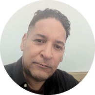

---

## About Me | [Versión Español](./about-me-es.md)

I am passionate about technological development, with a solid foundation in **Advertising** and experience across multiple areas of **technology and data analysis**. My roots lie in creativity and communication, thanks to my background as a Higher Technician in Advertising, but I have expanded my career into technology, from project management in Jira and Confluence to data analysis with R and BigQuery. I am curious, always seeking to learn and evolve in this dynamic field. Every achievement and certification I've obtained represents my dedication and commitment to professional growth.

[Go to Aspirations](#aspirations) | [Go to Portfolio & Projects](../) | [View my CV](./CV/)

---

## Aspirations

My aspirations are guided by a desire to contribute to innovative projects and transform data and technology into impactful tools. I aim to continue expanding my knowledge in **artificial intelligence** and **prompt generation**, fields in which I have started working with tools like DALL-E and MidJourney. Additionally, I am focused on strengthening my data analysis skills, with the goal of advising companies to make more informed, evidence-based decisions. I envision myself leading projects that combine creativity and analysis, turning challenges into strategic solutions that benefit various industries.

[Back to Start](#about-me) | [Go to Skills and Talents](#skills-and-talents) | [Go to Portfolio & Projects](../) | [View my CV](./CV/)

---

## Skills and Talents

My professional profile encompasses a combination of **technical skills** and **creativity**. Some of my key talents and skills include:

- **Web Development**: With advanced knowledge in HTML, CSS, and JavaScript, I have worked on projects ranging from educational games to interactive portfolios and educational websites.
- **Atlassian Management**: I am an expert in using Jira and Confluence to optimize business processes, with certifications demonstrating my ability to manage, configure, and customize these tools based on team needs.
- **Data Analysis**: With Google certifications in data analysis and experience in R and SQL, I am capable of organizing, cleaning, and visualizing data to answer key business questions.
- **AI Prompt Generation**: I have developed tools and platforms that allow users to generate personalized prompts for artificial intelligence, facilitating the image creation process in DALL-E and MidJourney.
- **Advertising and Communication**: My background in advertising enables me to create effective campaigns and visual content, combining data analysis and digital marketing to maximize audience engagement.

[Back to Aspirations](#aspirations) | [Go to Interests](#interests) | [Go to Portfolio & Projects](../) | [View my CV](./CV/)

---

## Interests

My personal and professional interests are aligned with my love for **technology and creativity**. I enjoy exploring new design tools and the possibilities of artificial intelligence. Additionally, I have a keen interest in cinema, Spanish gastronomy, reading science fiction in digital format, and cybersecurity. These interests are reflected in projects such as **CyberSpace Defenders** and **CyberSTARS**, where I aim to teach cybersecurity in a playful way. I am also fascinated by data analysis and visualization as powerful ways to tell stories and communicate information in an accessible, visual manner.

[Back to Skills and Talents](#skills-and-talents) | [Go to Professional Experience](#professional-experience) | [Go to Portfolio & Projects](../) | [View my CV](./CV/)

---

## Professional Experience

My experience spans a variety of projects and roles that include:

- **Development of Educational Platforms**: Creation of interactive sites and educational games like **CyberSTARS** and the game **CyberSpace Defenders** in JavaScript.
- **Prompt Generation and AI Tools**: Development of prompt generators for DALL-E and MidJourney, applying React and Node.js for personalized experiences.
- **Data Analysis for Cyclistic**: Comprehensive analysis of user behavior data for Cyclistic, using R and BigQuery for insights and conversion strategy recommendations.
- **Atlassian Management**: Development of guides and training in Jira and Confluence to optimize workflows and improve organizational communication.

[Back to Interests](#interests) | [Go to Achievements and Certifications](#achievements-and-certifications) | [Go to Portfolio & Projects](../) | [View my CV](./CV/)

---

## Achievements and Certifications

To date, I have completed 24 certifications, including:

- **Google Data Analytics Certification**
- **Atlassian Certifications**: Jira Administrator for Cloud, ITSM, and Confluence
- **Cloud Architecture Certification**

Each certification reinforces my commitment to continuous improvement and my desire to add value to the teams and projects in which I participate.

[Back to Professional Experience](#professional-experience) | [Go to Values](#values) | [Go to Portfolio & Projects](../) | [View my CV](./CV/)

---

## Values

I am an **analytical and committed** person, dedicated to continuous improvement. I believe in teamwork and effective communication, values I strive to apply in every project. My profile combines creativity and analysis, approaching each challenge with an open and flexible mindset.

[Back to Achievements and Certifications](#achievements-and-certifications) | [Go to Roots and Education](#roots-and-education) | [Go to Portfolio & Projects](../) | [View my CV](./CV/)

---

## Roots and Education

My background in advertising and communication has provided me with a strong foundation to understand consumer needs and communicate effectively. By integrating this background with skills in development and data analysis, I create solutions that are not only innovative but also aligned with business goals and current market expectations.

[Back to Values](#values) | [Go to Conclusion](#conclusion) | [Go to Portfolio & Projects](../) | [View my CV](./CV/)

---

## Conclusion

Throughout my career, I have sought to balance creativity and logic, combining technology with marketing and advertising. I am ready to face new challenges and collaborate on projects that aim to make a positive impact in the digital world and beyond.

[Back to Top](#about-me) | [Go to Portfolio & Projects](../) | [View my CV](./CV/)
