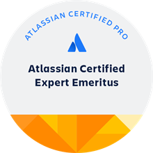
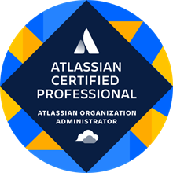
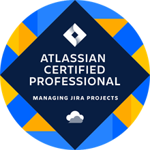
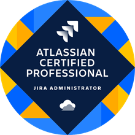

# Proyectos Atlassian
---
|  |  |  |  |  |  |
|:---------------------------------:|:---------------------------------:|:---------------------------------:|:---------------------------------:|:---------------------------------:|:---------------------------------:|
| [**Expert Emeritus**](https://cp.certmetrics.com/atlassian/en/public/badge/c?id=AT00235075&ccat=62&date=2024-2-8) | [**Certified Expert**](https://cp.certmetrics.com/atlassian/en/public/badge/r?id=262966&date=2024-1-30) | [**Cloud Organization Admin**](https://cp.certmetrics.com/atlassian/en/public/badge/c?id=557058:708d623c-a4cf-448f-900b-27999a96abda&ccat=52&date=2023-11-13) | [**Managing Jira Projects for Cloud**](https://cp.certmetrics.com/atlassian/en/public/badge/c?id=557058:708d623c-a4cf-448f-900b-27999a96abda&ccat=30&date=2023-12-12) | [**Jira Administrator for Cloud**](https://cp.certmetrics.com/atlassian/en/public/badge/c?id=557058:708d623c-a4cf-448f-900b-27999a96abda&ccat=26&date=2024-1-24) | [**Confluence Space Administration**](https://cp.certmetrics.com/atlassian/en/public/badge/c?id=557058:708d623c-a4cf-448f-900b-27999a96abda&ccat=35&date=2024-1-30) |
---

---
[English version](README-es.md) | [Regresar el Menú del Repositorio](../README.md)
---

Bienvenido a la sección de proyectos de Atlassian. Aquí encontrarás documentación y ejemplos de uso relacionados con las herramientas Atlassian.

## Contenidos

- **[Jira Software](./Jira%20Software/Anonymous%20Networking%20Inc/)**: Documentación sobre el uso de Jira Software.
- **[Jira Service Manager](./Jira%20Service%20Manager/)**: Guías de Jira Service Manager.

## En desarrollo 🚧

Algunos proyectos y documentos están en desarrollo y pueden estar sujetos a cambios.

---
[English version](README-es.md) | [Regresar el Menú del Repositorio](../README.md)
---
