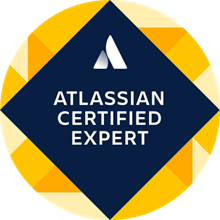

# Atlassian Products
---

## My Certifications
---

  <table style="margin: auto; border-collapse: collapse;">
      <tr>
        <td style="padding: 10px; text-align: center;">
          
           
          <a href="https://cp.certmetrics.com/atlassian/en/public/badge/c?id=AT00235075&ccat=62&date=2024-2-8" target="_blank"><em>Expert Emeritus</em></a>
        </td>
        <td style="padding: 10px; text-align: center;">
          
           
          <a href="https://cp.certmetrics.com/atlassian/en/public/badge/r?id=262966&date=2024-1-30" target="_blank"><em>Certified Expert</em></a>
        </td>
        <td style="padding: 10px; text-align: center;">
          
           
          <a href="https://cp.certmetrics.com/atlassian/en/public/badge/c?id=557058:708d623c-a4cf-448f-900b-27999a96abda&ccat=52&date=2023-11-13" target="_blank"><em>Cloud Organization Admin</em></a>
        </td>
      </tr>
      <tr>
        <td style="padding: 10px; text-align: center;">
          
           
          <a href="https://cp.certmetrics.com/atlassian/en/public/badge/c?id=557058:708d623c-a4cf-448f-900b-27999a96abda&ccat=30&date=2023-12-12" target="_blank"><em>Managing Jira Projects for Cloud</em></a>
        </td>
        <td style="padding: 10px; text-align: center;">
          
           
          <a href="https://cp.certmetrics.com/atlassian/en/public/badge/c?id=557058:708d623c-a4cf-448f-900b-27999a96abda&ccat=26&date=2024-1-24" target="_blank"><em>Jira Administrator for Cloud</em></a>
        </td>
        <td style="padding: 10px; text-align: center;">
          
           
          <a href="https://cp.certmetrics.com/atlassian/en/public/badge/c?id=557058:708d623c-a4cf-448f-900b-27999a96abda&ccat=35&date=2024-1-30" target="_blank"><em>Confluence Space Administration</em></a>
        </td>
      </tr>
    </table>

---

---
[Leer en español](README-es.md) | [Return to the Repository Main Page](../README.md)
---

Welcome to the Atlassian projects section. Here you will find documentation and usage examples related to Atlassian tools.

## Contents

- **[Jira](./Jira/)**: Documentation on using Jira.
- **[JQL Guide (Jira Query Language)](./Jira/JQL/guia_jql)**: JQL Guide.
- **[Jira Service Manager](./Jira%20Service%20Manager/)**: Jira Service Manager Guides.
- **[Confluence](./Confluence/)**: Managing space and pages in Confluence.
- **[Bitbucket](./Bitbucket/)**: Bitbucket usage and integration with Jira.

## Under development 🚧

Some projects and documents are under development and may be subject to change.

---

[Leer en español](README-es.md) | [Return to the Repository Main Page](../README.md)

---

### 🙏 Thank You for Visiting My Repository!

